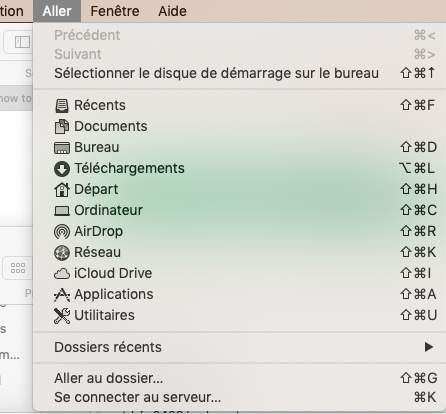
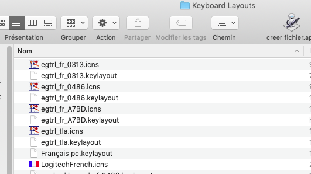
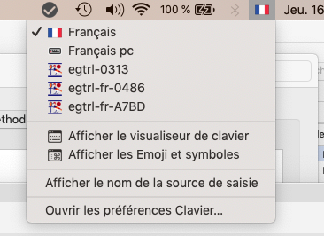
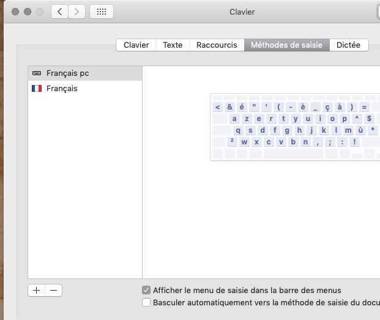
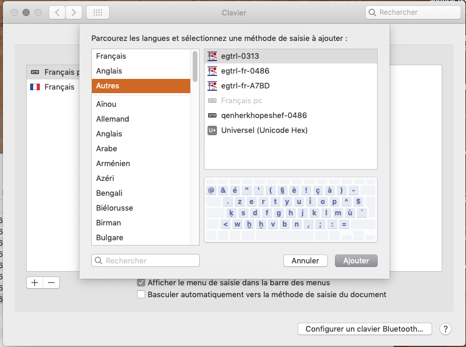

# Mac Unicode Keyboards for the transliteration of Egyptian Hieroglyphs

**Important** : especially for database, a [standard for translitteration](CAPS-LOCK) has been agreed upon. **Use the "leyden" named keyboards**.

See also [the page about transliteration on the JSesh web site](https://jsesh.qenherkhopeshef.org/fr/varia/transliteration).

This archive contains a number of "keyboards" which will enable you to type the transliteration of egyptian hieroglyphic texts with the Unicode encoding.

Those keyboards have been created with [Ukulele](https://software.sil.org/ukelele/). You can use them as basis for keyboards in other languages if you want. Contributions to this project are welcome.

When writing articles and so on, I strongly suggest to use Unicode, for a number of reasons:

- it will be far easier for the editors, as the transliteration won't be font specific;
- it allows easy mixing of all kinds of characters.
- if everything is encoded in Unicode, searches for Unicode text will "just work".

## Unicode encoding of transliteration

All the characters needed for "standard" (Gardiner-like) transliteration are available in Unicode fonts. More exotic encodings (Schenkel, Quack...) can also be done.

I'll first give a short explanation about encoding and its problems.

### Unicode and combined glyphs

Font technology has evolved a lot. Originally, a character like "é" was completely separated from the plain "e". However, all kinds of accents, underline, etc... combinations are possible. Unicode encoding distinguishes two approaches. 

1. The first is the original one, called "precomposed characters". Basically, "é" has its own code, different from the code of "e".
2. the second is to code "é" as a sequence of two codes :

~~~
LATIN SMALL LETTER E (U+0065) + COMBINING ACUTE ACCENT (U+0301)
~~~

The result is: `é`.

In theory, Unicode considers the first kind of encoding as a *legacy* system, to be compatible with old text files, and the *decomposed* approach is supposed to be the *correct* way.

However, some softwares deal badly with some *decomposed* characters, which is a bit problematic.

### Uppercase ẖ

In unicode, there is no precomposed character for uppercase ẖ. And it's likely that there will never be one. The problem is that the decomposed encoding is 
~~~
LATIN CAPITAL LETTER H (U+0048), COMBINING MACRON BELOW (U+0331)
~~~

In the font used to display this text, the result is: `H̱`.

It might be good, but in some cases, and *especially in italic* style, the position of the macron is incorrect : *`H̱`*

The only solution is to use a font which deals properly with this character combination.

### Egyptological Yod

Short story : use U+A7BD.

A long story could be written on the *egyptological yod*. As far as I know, it was discussed in the *Informatique et Egyptologie* congresses of 2006 and 2008, and as a result, the Unicode consortium agreed to *three* different decomposed encoding: "i" plus either `COMBINING COMMA ABOVE` (U+0313), `COMBINING RIGHT HALF RING ABOVE` (U+0357), or `COMBINING CYRILLIC PSILI PNEUMATA` (U+0486). The last one had the best potential in terms of rendering (especially for uppercase version), however in practice, the results were not very good.

At last, in 2019, Unicode 12 included `GLOTTAL I` (U+A7BD), originally named *EGYPTOLOGICAL YOD*. As it's a precomposed character, fonts which include it will normally give it a correct shape.

The current problem is that some fonts don't have U+A7BD yet.

Of course, you always have the option of using *j* instead!

## Use of the Mac Keyboard

Once the proper keyboard is installed and selected, the logic behind it is that a transliteration character is available by typing its *Manuel de Codage* code. 

So, you get an ayin `ꜥ` by typing a `a`, an aleph `ꜣ` by typing a `A`, and so on.

**For uppercase versions of the letters, such as Ḫ, Ꜣ or Ḏ, you should use the "CAPS-LOCK" key first.**

Note that to get an uppercase Ḏ, you must 

- press CAPS-LOCK and release it;
- press shift-d, which normally produces a ḏ, and as caps-lock is pressed, will produce a Ḏ.
- press CAPS-LOCK again if you don't want the next letters to be uppercase too.

The following table summarizes the ways to get the transliteration characters. To avoid wasting time and space, we haven't been systematic about uppercase characters, but the logic is always the same.

| letter              | keys                | comment                                    |
| ------------------- | ------------------- | ------------------------------------------ |
| ꜣ                   | shift-a             | code A723 (lowercase)                      |
| Ꜣ                   | CAPS-LOCK, shift-a  | code A722 (upper case)                     |
| egyptological yod-ꞽ | i                   | (actual code depends on keyboard)          |
| uppercase yod-Ꞽ     | shift-i             | (actual code depends on keyboard)          |
| ï                   | shift-y             | Leyden Unified Translitteration            |
| Ï                   | CAPS-LOCK, shift-y  |                                            |
| ꜥ                   | a                   | A725                                       |
| Ꜥ                   | CAPS-LOCK, a        | A724                                       |
| ḥ                   | shift-h             |
| ḫ                   | x                   |
| ẖ                   | shift-x             |
| ḳ                   | shift-q             |
| q                   | q                   |                                            |
| š                   | shift-s             |
| ṯ                   | shift-t             |
| ḏ                   | shift-d             |
| ṱ                   | option-t            | for demotic transliteration.               |
| h̭                   | c                   | for demotic transliteration.               |
| Ṱ                   | CAPS-LOCK, option-t |
| ø                   | option-0 (zero)     | for grammarian                             |
| ⸗                   | option-=            | for suffix pronouns                        |
| ⸢                   | see below           | Half brackets *(doubtful reading)*         |
| ⸣                   | see below     | Closing Half brackets *(doubtful reading)* |

## Other Useful characters

- ⸢...⸣, used (mainly by demotic scholars) for *unsure reading* ;
- ø, for "zero" subject and the like for linguists ;
- ⸗, used instead of "=" in front of suffix pronouns.

Note that not all fonts have those characters. 

### Mac french keyboard

| character | keys           |
| --------- | -------------- |
| ⸢         | option-\$       |
| ⸣         | option-shift-\$ |
| ⸗         | option-=       |
| ø         | option-0       |

### Mac US keyboard

| character | keys           |
| --------- | -------------- |
| ⸢         | option-4       |
| ⸣         | option-shift-4 |
| ⸗         | option-=       |
| ø         | option-0       |

## Keyboard versions

We propose a number of different keyboards, depending on:

- the keyboard layout, currently "us" or "french". Contributions would be welcome.
- the yod encoding.

### Installing a Mac Keyboard

You need to copy the keyboard files in the folder `~/Library/Keyboard Layouts`. To get there, either type "shift-command-g" while being in the folder, or use the menu `Finder/Go/Go to Folder`.

Type "~/Library":

Then click on "Keyboards Layouts"

Copy both the "keylayout" and the "icns" files for the layouts you want.

In this example, I have copied three different keyboards. You are quite likely to need only one.

Then, you need to activate the keyboards. Open `System Preferences`, and select `keyboards`:

Activate the keyboards and characters selectors (I don't know why they specifically speak about Emojis... it's about all kinds of characters !)

Open the keyboard menu on the top right of your screen (normally indicated by the flag for your current keyboard). Select the last item `Open Keyboard Preferences`

In the keyboard selection tab, click on "+".

Click on `Others` to get the custom keyboards, and add the ones you want.

It will be possible to change keyboard either through the keyboard menu, or with command-space (which is very useful to go back and forth between your "standard" keyboard and the transliteration keyboard.)

## Why no IFAO-compatible keyboard?

In the 1990's, the IFAO press wanted to use Unicode. But there were no ayin, aleph nor yod. They decided to use similar-looking characters to render aleph and ayin - as lots of fonts had those characters, it was a relatively practical move. To get fine printing result, one had just to adapt the existing fonts. This system has been used by others, including for databases. Trismegistos is an example.

I could easily produce a keyboard with this encoding (and actually, I have done it for my own use). You can edit one of my keyboards and produce an IFAO-compatible keyboard too, but I won't distribute it. The reason is that I want to encourage the adoption of standard Unicode encoding. We now have alph, ayin, and yod in Unicode, let's use them.

## Changes

2024/02/14
: added ï for [Leyden Unified Translitteration](https://www.iae-egyptology.org/the-leiden-unified-transliteration) ; made *q* the default shape for qof, not *ḳ*.
    - moved non-leyden keyboards to the *legacy* folder
    - "A7BD" keyboards are replaced by "leyden" keyboards.

